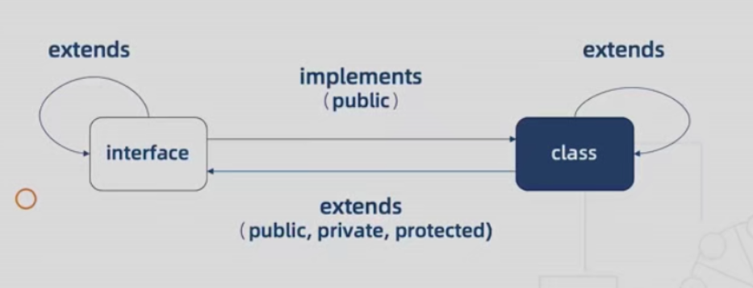

# TS 从零开始

## 安装和运行

安装

```js
npm install -g typescript
```

运行

```js
 tsc index.ts
```

[线上练习(TypeScript Playground)](https://www.typescriptlang.org/zh/play)
[编译](https://typescript-play.js.org/)

## 基础类型

### Boolean 类型

```ts
let isDone: boolean = false;
```

### Number 类型

```ts
let count: Number = 99;
```

### String 类型

```ts
let myname: String = 'jack';
```

### Array 类型

```ts
let list: number[] = [1, 2, 3];
推荐;
let list: Array<number> = [1, 2, 3];
```

### Tuple 类型

一个数组里面包含不同类型值和已知数量，可以使用元组(Tuple).

```ts
let tupleArr = [number, string];
tupleArr = [10, 'demo'];
console.log(tupleArr[0], tupleArr[1]); //10, 'demo'
tupleArr[1] = true; // Type 'boolean' is not assignable to type 'string'. 类型不匹配
tupleArr[2] = '123'; //Type '"123"' is not assignable to type 'undefined', Tuple type '[number, string]' of length '2' has no element at index '2'
console.log(tupleArr); // [10, true, "123"]  上面报错，但是还是能log出来
```

### Enum 类型

正常是定义一些带名字的常量（星期，颜色等）

-   数字枚举

```ts
enum Status {
    Begin,
    Underway,
    End,
}
console.log(Status.Begin); //0, 从0开始排号 Underway = 1, End = 2
console.log(Status[2]); //'End' string类型
//设置Begin= 2，依次排号
enum Status {
    Begin = 2,
    Underway,
    End,
}
//覆盖
enum Status {
    Begin = 1,
    Underway = 0,
    End,
}
console.log(Status[1]); // 'End' 建议不要这么写
//枚举成员赋值
Status.Begin = 100; //会报错，不能赋值
```

-   字符串枚举

```ts
const Message = {
    Success: '成功',
    Fail: '失败',
};
```

-   异构枚举: 混合字符串和数字成员

```ts
enum Status1 {
    Begin = 3,
    Underway = 5,
    End = '7',
}

enum Status2 {
    Begin = '2',
    Underway,
    End,
}
console.log(Status2.End); //undefined
```

-   常量枚举: 使用 const，它会在编译阶段被删除，并且不能包含计算成员

```ts
const enum Month {
    Jan,
    Feb,
    Mar,
}
let month = [Month.Jan, Month.Feb, Month.Mar]; //只需要对象的值
```

### Any 类型

any 可以代表任何类型. 可以任意赋值和调用方法， 避开所有类型检查

```ts
let list: any[] = [1, true, 'free'];
list[1] = 100;
```

### Unknown 类型

所有类型也都可以赋值给 unknown， 也是顶级类型(同 any)， 但是更

```ts
//当类型为 unknown 的值赋值给其他类型的变量
let value: unknown;

let value1: unknown = value; // OK
let value2: any = value; // OK
let value3: boolean = value; // Error
let value4: number = value; // Error
let value5: string = value; // Error
let value6: object = value; // Error
let value7: any[] = value; // Error
let value8: Function = value; // Error

//所以TypeScript不允许我们对类型为 unknown 的值执行任意操作
```

### Void 类型

表示没有任何类型， 通常用在函数没有返回值

```ts
function fn(): void {
    console.log('hello world');
}
```

声明 void 类型的变量， 只能赋值 undefined 和 null

```ts
let unusable: void = undefined;
```

通过 typeof 运算符，instanceof 运算符和自定义类型保护函数可以将 unknown 类型缩小为更具体的类型范围

### Null 和 Undefined

```ts
let u: undefined = undefined;
let n: null = null;
```

### Never 类型

never 表示那些永不存在的值的类型，

```ts
let error = () => {
    throw new Error('error');
};

let endless = () => {
    while (true) {}
};
```

### Object 类型

非原始类型

```ts
declare function create(o: object | null): void;

create({ prop: 0 }); // OK
create(null); // OK

create(42); // Error
create('string'); // Error
create(false); // Error
create(undefined); // Error
```

### Symbol 类型

```ts
let s1: symbol = Symbol();
```

## 断言

### 类型断言

尖括号语法

```ts
let someValue: any = 'this is a string';
let strLength: number = (<string>someValue).length;
```

as 语法（推荐）

```ts
let someValue: any = 'this is a string';
let strLength: number = (someValue as string).length;
```

### 非空断言

### 确定赋值断言

## 自定义类型

### 接口

```ts
interface User {
    name: string;
    age?: number; //可选
    readonly gender: 'male'; //只读
    [propName: string]: string; //其他的任意属性（key为string，value为string）
}
```

### 类型别名

```ts
type User = {
    name: string;
    age: number;
};
```

### interface 和 type 的区别

#### 相同点

1. 都可以用来描述一个对象或函数
2. 都允许拓展（extends）, 2 者可以相互 extend

```ts
interface Name {
  name: string;
}
interface Identity{
  identity: number
}
interface User extends Name {
  age: number;
}
interface User extends Name, Identity{
  age: number;
}
---
type Name = {
  name: string;
}
type User = Name & { age: number  };
```

#### 不同点

1. type 可以声明基本类型别名，联合类型，元组等类型, interface 不可以

```ts
type Name: string

type Cat = { name: 'tom'}
type Mouse = { name: 'jerry'}
//联合类型
type  Pet = Cat | Mouse
//元组
type Cartoon =  [Cat, Mouse]
```

2. interface 能够声明合并, type 不可以

```ts
interface User {
    name: string;
    age: number;
}

interface User {
    gender: string;
}

const user: User = { name: '123', age: 12, gender: 'male' };
```

3. interface 有可选属性和只读属性, type 没有

## 函数

### 基本使用

```ts
function add(x: number, y: number): number {
    return x + y;
}

let myAdd = function(x: number, y: number): number {
    return x + y;
};
```

### 可选参数及默认参数

```ts
function createUser(name: string, age?: number, height: number = 180): string {
    return `my name is ${name}, age is ${age}, height is ${height}`;
}

createUser('jack', 10); //"my name is jack, age is 10, height is 180"
```

### 剩余参数

```ts
function buildName(firstName: string, ...restOfName: string[]) {
    return firstName + ' ' + restOfName.join(' ');
}

let employeeName = buildName('Joseph', 'Samuel', 'Lucas', 'MacKinzie'); //"Joseph Samuel Lucas MacKinzie"
```

### 函数类型接口

```ts
let add: (x: number, y: number) => number;

interface Add {
    (x: number, y: number): number;
}

type Add = (x: number, y: number) => number;

let add: Add = (a, b) => a + b;
```

### 函数重载

函数重载或方法重载是使用相同名称和不同参数数量或类型创建多个方法的一种能力。

```ts
function add(a: number, b: number): number;
function add(a: string, b: string): string;
function add(a: string, b: number): string;
function add(a: number, b: string): string;
function add(a: Combinable, b: Combinable) {
    if (typeof a === 'string' || typeof b === 'string') {
        return a.toString() + b.toString();
    }
    return a + b;
}
```

其他重载：

-   重载类中的成员方法
-   构造函数重载
-   特定重载签名

为啥不用联合类型?

```ts
type Combinable = string | number;

function add(a: Combinable, b: Combinable) {
    if (typeof a === 'string' || typeof b === 'string') {
        return a.toString() + b.toString();
    }
    return a + b;
}
const result = add('Semlinker', ' Kakuqo');
result.split(' '); //error,  Combinable 和 number 类型的对象上并不存在 split 属性
```

## 类

### 基本使用

```ts
class Person {
    name: string;
    constructor(name: string) {
        this.name = name;
    }
}
let human = new Person('tom');
console.log(human.name); //tom
```

### 继承

```ts
class Animal {
    name: string;
    constructor(name: string) {
        this.name = name;
    }

    move(speed: number = 0) {
        console.log(`${this.name}移动了${speed}`);
    }
}

class Cat extends Animal {
    constructor(name: string, color: string) {
        super(name);
        this.color = color;
    }
    color: string;
    move(speed: number = 10) {
        super.move(speed);
        console.log(this.color);
    }
}
let cat = new Cat('tom', 'yellow');
cat.move(20); //tom移动了20, yellow
```

### 成员修饰符

1. public
   标记变量或者方法是公用的,父类和子类都能使用, 当你没有使用任何范围关键字修饰，默认为 public

```ts
class Person {
    public name: string;
    public constructor(name: string) {
        this.name = name;
    }
    public run();
}
```

2. private
   标记一个类中私有变量的关键字，只能在当前类使用，子类不可以访问

```ts
class Person {
    private name: string;
    constructor(name: string) {
        this.name = name;
    }
}

class Chinese extends Person {
    constructor(name: string) {
        super(name);
        console.log(super.name); //报错error，不能访问
    }
}
//当private放在constructor前面，代表该类不能实例化，也不能继承
```

3. protected
   标记的变量在基础类的子类和衍生类中都能访问，但是不能在类的实例访问

```ts
class Person {
    protected name: string;
    constructor(name: string) {
        this.name = name;
    }
}

new Person('jack').name; //报错error，不能访问

class Chinese extends Person {
    constructor(name: string) {
        super(name);
        console.log(super.name); //可以访问
    }
}
//当private放在constructor前面，代表该类不能实例化, 可以继承
```

4. readonly
   用来修饰只读属性,必须在声明时或构造函数里被初始化

```ts
class Person {
    readonly name: string;
    readonly age: number = 18;
    constructor(name: string) {
        this.name = name;
    }
}
new Person('jack').age = 20; //报错error, 只读不能赋值
```

### 访问器属性

在对象中设置了 get 和 set 方法，TypeScript 会默认用 readonly 修饰 set 和 get 方法。

```ts
class ValidName {
    private name: string = '';

    get fullName() {
        return this.name;
    }

    set fullName(newName: string) {
        if (newName && newName.length > 10) {
            console.error('输入的名字太长！');
        }
        this.name = name;
    }
}

let enchanter = new ValidName();
enchanter.fullName = 'Harry Potter'; //error
```

### 静态类

使用 static 修饰符修饰变量，可以使得该变量只能被该类直接访问，子类也可以直接访问。

```ts
class StaticObj {
    static age: number = 18;

    getAge() {
        return StaticObj.age;
    }
}
console.log(StaticObj.age); //18
new StaticObj().age; //报错，error
```

### 抽象类和多态

-   抽象类不能实例化，只能作为基础类供其他类继承。
-   使用 abstract 关键字定义抽象类和抽象方法，抽象方法只包括定义，不包括实现。
-   基于抽象类的衍生类必须实现抽象类的抽象方法。

```ts
abstract class Animal {
    abstract getName(): void;
}

class Cat extends Animal {
    public name: string = 'tom';
    public age: number = 5;

    // 这里实现了抽象类的getName方法
    getName(): void {
        console.log(this.name);
    }
    getAge() {
        return this.age;
    }
}
let cat = new Cat();
cat.getName(); //tom
console.log(cat.getAge()); //5
```

多态：父类定义一个方法不去实现，让继承他的子类去实现，每一个子类有不同的表现, 多态属于继承

```ts
class Mouse extends Animal {
    public name: string = 'jerry';
    getName(): void {
        console.log(this.name);
    }
}
let mouse = new Mouse();
let animals: Animal[] = [cat, mouse];
animals.forEach(i => i.getName()); //tom, jerry
```

### 类与接口

#### implement

从父类或者接口实现所有的属性和方法，同时可以重写属性和方法

```ts
interface Human{
    name: string;
    eat(): void
}
class Asian implement Human{
   name: string = 'hmm';
   eat(){}
   sleep(){}
}
```

#### 类可以当作接口使用

```ts
class Point {
    x: number;
    y: number;
}
interface Point3d extends Point {
    z: number;
}
let point3d: Point3d = { x: 1, y: 2, z: 3 };
```

#### 接口和类的关系



## 泛型

不预定确认的数据类型，具体类型在使用的时候确定。

### 基本使用

允许同一个函数接受不同类型参数的一种模板，通常创建可复用的组件

```ts
function identity<T>(arg: T): T {
    return arg;
}
console.log(identity<Number>(1)); //Number像传参数传给T
console.log(identity(1)); //不传Number，编译器自动识别1的类型

//多个泛型
function identity<T, U>(value: T, message: U): T {
    console.log(message);
    return value;
}
console.log(identity<Number, string>(68, 'Semlinker'));
```

//箭头函数的泛型写法(2 种)

```ts
const Generic = <T extends unknown>(value: T) => <U>(name: U) => {
    return value;
};
```

### 常见泛型变量

-   K（Key）：表示对象中的键类型；
-   V（Value）：表示对象中的值类型；
-   E（Element）：表示元素类型。

### 泛型接口

```ts
//type
type Identity = <T>(arg: T) => T;
//interface
interface Identity<T = number> {
    (arg: T): T;
}

function identity<T>(arg: T): T {
    return arg;
}
let myIdentity: Identity = identity;
```

### 泛型类

```ts
class Log<T> {
    name: T;
    //static age: T //静态成员不能使用泛型
    run(value: T) {
        console.log(value);
        return value;
    }
}

let log1 = new Log<number>();
log1.name = 'jack'; //报错，只能传number
log1.run(1); //1

let log2 = new Log(); //可以传任意类型
log2.name = 'jack';
log2.run(true); //true
```

### 泛型约束

使用 extends 实现

```ts
interface Length {
    length: number;
}
function log<T extends Length>(value: T): T {
    console.log(value, value.length);
    return value;
}
log([1]); //1
log('123'); //3
log({ length: 5 }); //5
```

## 类型检查机制

### 类型推断

1. 基础类型

```ts
let x = 3; //自动推断number类型
```

2. 最佳通用类型

```ts
let x = [1, null]; //推断出x: (number | null)[]
class Rhino {}
class Elephant {}
class Snake {}
let zoo = [new Rhino(), new Elephant(), new Snake()]; //(Rhino | Elephant | Snake)[]
```

3. 上下文类型

```ts
window.onkeydown = event => {
    //推断event的类型
    console.log(event.button); //error
};
```

### 类型兼容性

```
X兼容Y : X（目标类型） = Y（源类型）
```

#### 子类型赋值

```ts
let s: string = 'hello'; //关闭tsconfig.json中strictNullChecks,字符串变量可赋值给null
s = null; //由于在 ts中，null是所有类型的子类型，也就是说 字符类型兼容null类型，所以可以赋值
```

#### 接口兼容性

```ts
interface X {
    a: any;
    b: any;
}
interface Y {
    a: any;
    b: any;
    c: any;
}
let x: X = { a: 1, b: 2 };
let y: Y = { a: 1, b: 2, c: 3 };
x = y; // x兼容y
y = x; // error
```

接口之间兼容时，成员少的兼容成员多的

#### 函数兼容性

1. 参数方面

```ts
type Handler = (a: number, b: number) => void;
function hof(handler: Handler) {
    // handler：目标函数
    return handler;
}

// 1)参数个数，参数多的兼容参数少的
let handler1 = (a: number) => {}; //源函数
hof(handler1);
let handler2 = (a: number, b: number, c: number) => {};
hof(handler2); //error

// 2)可选参数和剩余参数
let a = (p1: number, p2: number) => {};
let b = (p1?: number, p2?: number) => {};
let c = (...args: number[]) => {};
a = b;
a = c; //固定参数是可以兼容可选参数和剩余参数的
b = c;
b = c; //error 可选参数不兼容固定参数和剩余参数
c = a;
c = b; //剩余参数可以兼容固定参数和可选参数
```

2. 参数类型

```ts
let handler3 = (a: string) => {}; // handler3：源函数
hof(handler3); //error
```

3. 返回值类型、

```ts
let f = () => ({ name: 'tom' });
let g = () => ({ name: 'tom', age: 12 });
f = g; //成员少的兼容成员多的
g = f; //error
```

4. 函数重载

```ts
// 重载列表
function overload(a: number, b: number): number;
function overload(a: string, b: string): string;
// 具体实现
function overload(a: any, b: any): any {}
// fucntion overload(a: any, b: any, c: any): any {} // 增加一个参数，不兼容(参数多的兼容参数少的)
// function overload(a: any, b: any) {} // 去除返回值类型，不兼容（返回值参数数少的兼容参数多的）
```

#### 枚举兼容性

```ts
enum Fruit {
    Apple,
    Banana,
}
enum Color {
    Red,
    Yellow,
}
let fruit: Fruit.Apple = 3;
let no: number = Fruit.Apple; //枚举类型和数字类型相互兼容
let color: Color.Red = Fruit.Apple; //枚举类型之间不兼容
```

#### 类的兼容性

同接口，只比较结构：成员少的兼容成员多的

```ts
class A {
    constructor(p: number, q: number) {}
    id: number = 1;
}
class B {
    static s = 1;
    constructor(p: number) {}
    id: number = 2;
}
let aa = new A(1, 2);
let bb = new B(1);
aa = bb;
bb = aa;
//构造函数和静态成员不比较的,增加private后，有私有成员不兼容其他。
class C extends A {}
let cc = new C(1, 2);
aa = cc;
cc = aa;
//父类和子类的实例是可以完全兼容的,包含private
```

#### 泛型的兼容性

```ts
interface Empty<T> {
    value: T
};
let a: Empty<string> = {};
let b: Empty<number> = {};
a = b;
b = a;
//泛型接口中没有成员，可以兼容，反之不兼容
let log1 = <T>(x: T): T => {
    return x;
};
let log2 = <U>(y: U): U => {
    return y;
};
log1 = log2; //泛型函数兼容
log1<number> = log2; // error, 指定指定类型参数不兼容
```

### 类型保护

类型保护是可执行运行时检查的一种表达式，用于确保该类型在一定的范围内

1. in 关键字

-   in 操作符可以安全的检查一个对象上是否存在一个属性

```ts
interface A {
    x: number;
}

interface B {
    y: string;
}

function doStuff(q: A | B) {
    if ('x' in q) {
        // q: A
    } else {
        // q: B
    }
}
```

2. typeof 关键字

-   判断一个变量的类型

```ts
function padLeft(value: string, padding: string | number) {
    if (typeof padding === 'number') {
        return Array(padding + 1).join(' ') + value;
    }
    if (typeof padding === 'string') {
        return padding + value;
    }
    throw new Error(`Expected string or number, got '${padding}'.`);
}
padLeft('1', 2); //"  1"
padLeft('1', '3'); //"31"
```

3. instanceof 关键字

-   判断一个实例是不是属于某个类

```ts
class Foo {
    foo = 123;
    common = '123';
}

class Bar {
    bar = 123;
    common = '123';
}

function doStuff(arg: Foo | Bar) {
    if (arg instanceof Foo) {
        console.log(arg.foo); // ok
        console.log(arg.bar); // Error
    } else {
        console.log(arg.foo); // Error
        console.log(arg.bar); // ok
    }
}

doStuff(new Foo());
doStuff(new Bar());
```

4. 自定义类型保护

```ts
interface Cat {
    lazy: true;
}
interface Dog {
    lazy: false;
}
function isCat(x: Cat | Dog): x is Cat {
    return x.lazy;
}
```

## 高级类型

### 交叉类型

将多个类型合并为一个类型, 使用`&`运算符

```ts
type PartialPointX = { x: number };
type Point = PartialPointX & { y: number };

let point: Point = {
    x: 1,
    y: 1,
};
```

同名基础类型属性的合并

```ts
interface X {
    c: string;
    d: string;
}

interface Y {
    c: number;
    e: string;
}
type XY = X & Y;

let p: XY = { c: 6, d: 'd', e: 'e' }; //Type 'number' is not assignable to type 'never'.
//c既是string又是number不存在的，自动转为never
```

同名非基础类型属性的合并

```ts
interface A {
    x: { d: number };
}
interface B {
    x: { e: string };
}
type AB = A & B;
let ab: AB = {
    x: {
        d: 12,
        e: 'semlinker',
    },
}; //存在相同的成员，且成员类型为非基本数据类型, 是可以合并的
```

### 联合类型

多个类型的并集，使用`|`运算符，通常与 null 或 undefined 一起使用

```ts
const sayHello = (name: string | undefined) => {
    return name;
};
sayHello('semlinker');
sayHello(undefined);
```

### 索引类型

### 映射类型

### 条件类型

## 命名空间

## 声明合并

## 声明文件

## 编译上下文

tsconfig.json
